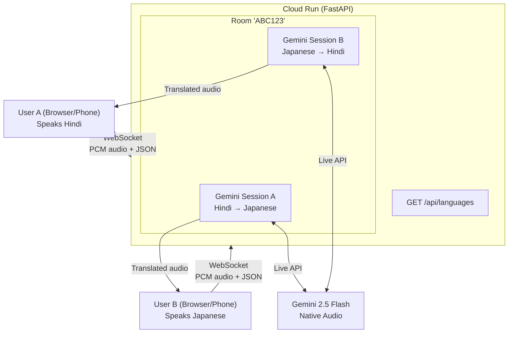
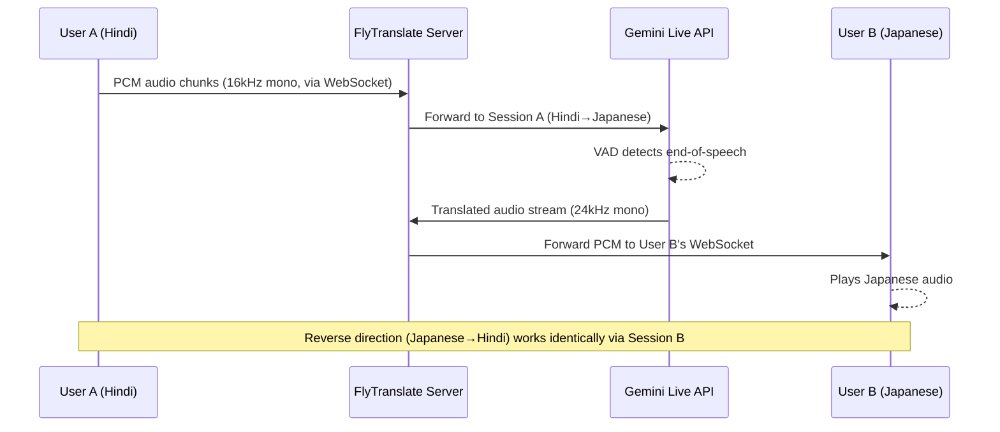

# FlyTranslate

Real-time speech-to-speech translation between any two languages, powered by Gemini Live API. Translating on the fly.

> **Built for the [Gemini Live Agent Challenge](https://geminiliveagentchallenge.devpost.com/)** — real-time speech-to-speech translation using Gemini 2.5 Flash Native Audio. Category: "The Live Agent."

**Use case:** Two people who don't share a language — travellers, expats, military families stationed abroad — open the app, pick their languages, and just talk. No typing, no buttons, no turn-taking.

**Blog:** [We Built a Real-Time Voice Translator Because We Lived the Problem](https://medium.com/@shashwataditya7/we-built-a-real-time-voice-translator-because-we-lived-the-problem-4dcca7a55866)

**Live:** [flytranslate-232247135155.us-central1.run.app](https://flytranslate-232247135155.us-central1.run.app)

## How it works

```
User A (Hindi)                              User B (Japanese)

  🎤 "शुक्रवार को दो लोगों             🔊 「金曜日の午後7時に2名で
     के लिए टेबल बुक                       予約したいのですが」
     करनी है"
                    ↘                   ↗
                 ┌──────────────────────┐
                 │  FlyTranslate        │
                 │  (Cloud Run)         │
                 │                      │
                 │  Gemini Session A    │
                 │  Hindi → Japanese    │
                 │                      │
                 │  Gemini Session B    │
                 │  Japanese → Hindi    │
                 └──────────────────────┘
                    ↗                   ↘
  🔊 "何名様ですか？"                   🎤 「何名様ですか？」
     → "कितने लोग हैं?"
```

Two independent Gemini Live API sessions handle each direction. Audio streams over WebSockets as raw PCM. 70+ languages supported. Any pair.

## Tech stack

- **Backend:** Python, FastAPI, Google GenAI SDK (Gemini Live API)
- **Frontend:** Vanilla JS, Web Audio API (AudioWorklet), PWA
- **Deployment:** Google Cloud Run
- **Model:** `gemini-2.5-flash-native-audio-latest`

## Project structure

```
apps/
├── server/          # FastAPI backend
│   ├── config.py    # Language registry (70+ langs), system prompts, Gemini config
│   ├── room.py      # Room management (in-memory)
│   ├── gemini_session.py  # Gemini Live API wrapper
│   └── main.py      # WebSocket handler, orchestration, /api/languages
├── web/             # Browser frontend (PWA)
│   ├── index.html
│   └── audio-processor.js
└── ios/             # iOS app (future)

tests/               # pytest suite (65 tests)
docs/                # Architecture decisions, protocol spec
experiments/         # Feasibility tests
```

## Local setup

```bash
# Clone and setup
git clone <repo-url>
cd flytranslate
python3 -m venv venv
source venv/bin/activate
pip install -r apps/server/requirements.txt

# Configure
cp .env.example .env
# Edit .env and add your GEMINI_API_KEY

# Run
uvicorn apps.server.main:app --reload

# Open two browser tabs to http://localhost:8000
# Tab 1: Start a Call → pick your language → share room code
# Tab 2: Enter room code → Join → pick your language
# Talk!
```

## Run tests

```bash
pytest -m "not live" -v    # Unit tests (mocked Gemini)
pytest -v                   # All tests including live Gemini API
```

## Deploy to Cloud Run

```bash
gcloud run deploy flytranslate \
  --source=. \
  --region=us-central1 \
  --allow-unauthenticated \
  --min-instances=1 \
  --max-instances=1 \
  --memory=512Mi \
  --cpu=1 \
  --timeout=3600 \
  --cpu-always-allocated \
  --session-affinity \
  --set-secrets=GEMINI_API_KEY=gemini-api-key:latest
```

## Architecture



### Audio flow (one utterance)



<details>
<summary><strong>API Reference</strong></summary>

#### `GET /api/languages`

Returns all 70+ supported languages.

```json
[
  { "code": "en", "name": "English", "native_name": "English", "flag": "🇺🇸", "bcp47": "en-US", "recommended": true },
  { "code": "ja", "name": "Japanese", "native_name": "日本語", "flag": "🇯🇵", "bcp47": "ja-JP", "recommended": true },
  { "code": "hi", "name": "Hindi", "native_name": "हिन्दी", "flag": "🇮🇳", "bcp47": "hi-IN", "recommended": false }
]
```

#### `WS /ws`

Single WebSocket endpoint. Carries both binary audio frames and JSON signaling.

**Client → Server**

| Message | Fields | Description |
|---------|--------|-------------|
| `create_room` | `language` | Create a room, speak this language |
| `join_room` | `room`, `language` | Join existing room by code |
| `leave` | — | End the call |
| *(binary frame)* | — | PCM audio: 16kHz, 16-bit, mono, 3200-byte chunks (100ms) |

**Server → Client**

| Message | Fields | Description |
|---------|--------|-------------|
| `room_created` | `room` | Room code to share |
| `room_joined` | `room`, `participants` | Both users connected |
| `call_started` | — | Gemini sessions ready, start sending audio |
| `transcript` | `direction`, `text` | `input` = what peer said, `output` = translation |
| `turn_complete` | — | One utterance fully translated |
| `peer_disconnected` | — | Other user left |
| `error` | `message` | Error description |

**Audio formats**

| Direction | Sample rate | Encoding | Channels | Chunk size |
|-----------|-------------|----------|----------|------------|
| Client → Server | 16kHz | PCM 16-bit LE | Mono | 3200 bytes (100ms) |
| Server → Client | 24kHz | PCM 16-bit LE | Mono | Variable |

</details>

## Built for

[Gemini Live Agent Challenge](https://geminiliveagentchallenge.devpost.com/) — "The Live Agent" category.

#GeminiLiveAgentChallenge

## Built by

Shash and Aika at [Kigaru](https://kigaru.com)

## License

MIT
